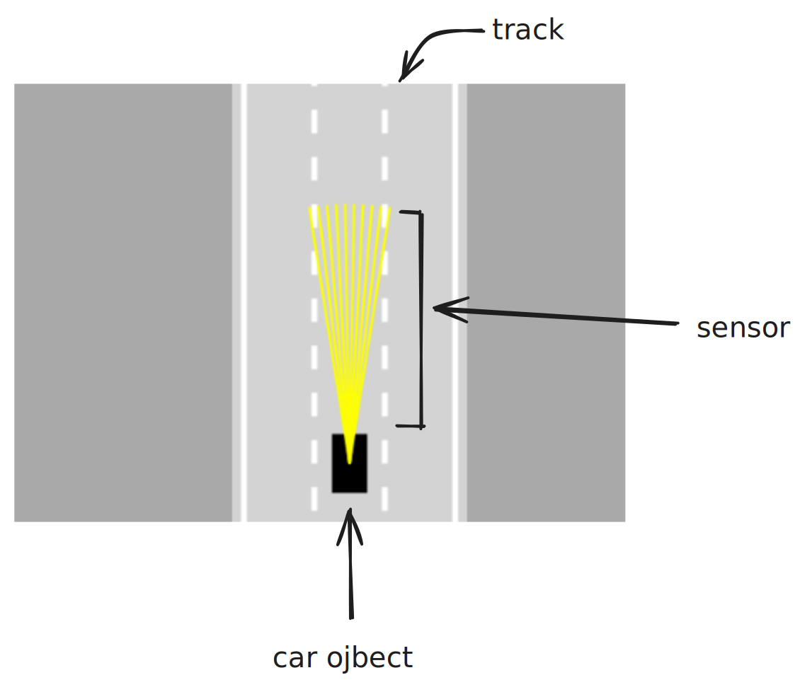

<h4 align="center" > Simulating self-driving 🚗 in javascript
</h4>

##### Abstract:

---

##### Introduction:

---

##### Process:
    - 1.Car driving mechanism
    - 2.Road Definition
    - 3.Artificial Sensors
    - 4.Collision Detection
    - 5.Traffic Simulation
    - 6.Neural Networks
    - 7.Visualizing NN
    - 8.Optimizing NN
    - 9.Fine Tuning
##### Video:

---

##### Images:

---

##### Diagrams:

---

##### Formulaes:

---

##### References:
https://developer.mozilla.org/en-US/docs/Web/API/Canvas_API
https://developer.mozilla.org/en-US/docs/Web/API/CanvasRenderingContext2D

---

#### @Contributors:

###### Extras:
- use excaldraw extension to read the `excalidraw.png`

##### Flow:

